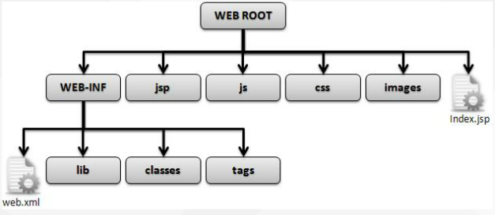
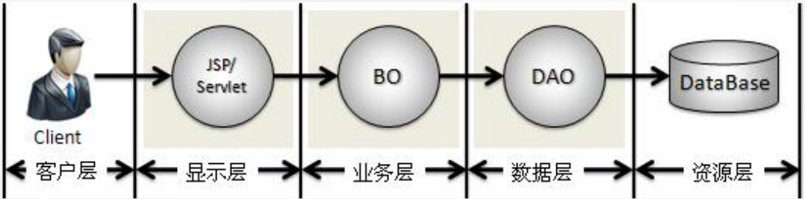
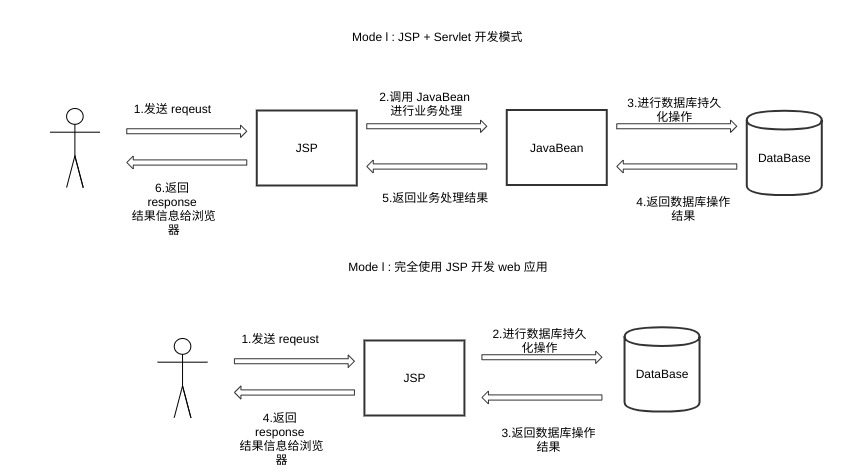
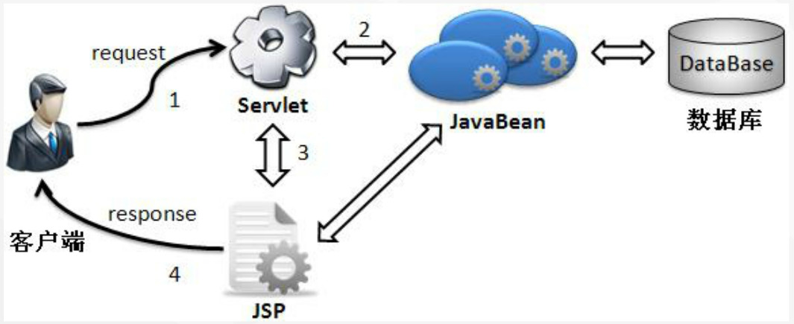
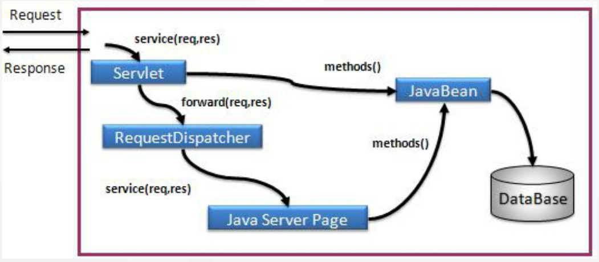

# Java Web

## 1.Getting Started

## 2.开发环境

## 3.控制层Web开发

### Servlet继承体系

**Servlet**

Servlet 类提供了五个方法，其中三个生命周期方法和两个普通方法。

```java
//Servlet的生命周期:从Servlet被创建到Servlet被销毁的过程
//一次创建，到处服务
//一个Servlet只会有一个对象，服务所有的请求
/*
 * 1.实例化（使用构造方法创建对象）
 * 2.初始化  执行init方法
 * 3.服务     执行service方法
 * 4.销毁    执行destroy方法
 */
public class ServletDemo1 implements Servlet {

    //public ServletDemo1(){}

     //生命周期方法:当Servlet第一次被创建对象时执行该方法,该方法在整个生命周期中只执行一次
    public void init(ServletConfig arg0) throws ServletException {
                System.out.println("=======init=========");
        }

    //生命周期方法:对客户端响应的方法,该方法会被执行多次，每次请求该servlet都会执行该方法
    public void service(ServletRequest arg0, ServletResponse arg1)
            throws ServletException, IOException {
        System.out.println("hehe");

    }

    //生命周期方法:当Servlet被销毁时执行该方法
    public void destroy() {
        System.out.println("******destroy**********");
    }
//当停止tomcat时也就销毁的servlet。
    public ServletConfig getServletConfig() {

        return null;
    }

    public String getServletInfo() {

        return null;
    }
}
```

**GenericServlet**

GenericServlet 是一个抽象类，实现了 Servlet 接口，并且对其中的 init() 和 destroy() 和 service() 提供了默认实现。在 GenericServlet 中，主要完成了以下任务：

- 将 init() 中的 ServletConfig 赋给一个类级变量，可以由 getServletConfig 获得；
- 为 Servlet 所有方法提供默认实现；
- 可以直接调用 ServletConfig 中的方法

如果继承这个类的话，我们必须重写 service() 方法来对处理请求。

**HttpServlet**

HttpServlet 也是一个抽象类，它进一步继承并封装了 GenericServlet，使得使用更加简单方便，由于是扩展了 Http 的内容，所以还需要使用 HttpServletRequest 和 HttpServletResponse，这两个类分别是 ServletRequest 和 ServletResponse 的子类。

HttpServlet 中对原始的 Servlet 中的方法都进行了默认的操作，不需要显式的销毁初始化以及 service()，在 HttpServlet 中，自定义了一个新的 service() 方法，其中通过 getMethod() 方法判断请求的类型，从而调用 doGet() 或者 doPost() 处理 get,post 请求，使用者只需要继承 HttpServlet，然后重写 doPost() 或者 doGet() 方法处理请求即可。

### 第一个Servlet程序

通常是继承HttpServlet类，至少要重写doGet方法

```java
package org.mooc;

import java.io.*;

import javax.servlet.*;
import javax.servlet.http.*;

/**
 * Servlet implementation class HelloServlet
 */
public class HelloServlet extends HttpServlet {
	private static final long serialVersionUID = 1L;
       
    /**
     * @see HttpServlet#HttpServlet()
     */
    public HelloServlet() {
        super();
        // TODO Auto-generated constructor stub
    }

	/**
	 * @see HttpServlet#doGet(HttpServletRequest request, HttpServletResponse response)
	 */
	protected void doGet(HttpServletRequest request, HttpServletResponse response) throws ServletException, IOException {
		// TODO Auto-generated method stub
		PrintWriter out = response.getWriter();
		out.println("<html><head><title>HelloWorldServlet</title></head>");
		out.println("<body><h1>Hello World!!!</h1>");
		out.println("</body></html");
		out.close();
	}
}
```

#### 部署Servlet

对于web2.0，需要修改web.xml文件

```xml
<web-app>
	<servlet>
	    <servlet-name>HelloServlet</servlet-name>
    	<servlet-class>org.mooc.HelloServlet</servlet-class>
	</servlet>
	<servlet-mapping>
	    <servlet-name>HelloServlet</servlet-name>
    	<url-pattern>/HelloServlet</url-pattern>
	</servlet-mapping>
</web-app>
```

对于web3.0，只需添加注解

`@WebServlet("/HelloServlet")`

### Servlet生命周期

- Servlet 通过调用 init () 方法进行初始化。
- Servlet 调用 service() 方法来处理客户端的请求。
- Servlet 通过调用 destroy() 方法终止（结束）。
- 最后，Servlet 是由 JVM 的垃圾回收器进行垃圾回收的。

每次服务器接收到一个 Servlet 请求时，服务器会产生一个新的线程并调用服务

### Servlet与表单

#### get方法

请求的数据会附加在URL之后，以?分割URL和传输数据，多个参数用&连接。URL的编码格式采用的是ASCII编码，而不是unicode，即是说所有的非ASCII字符都要编码之后再传输。GET 方法有大小限制：请求字符串中最多只能有 1024 个字符。Servlet 使用 **doGet()** 方法处理这种类型的请求。

```
URL？参数名1=值&参数名2=值&...
http://www.test.com/hello?key1=value1&key2=value2
```

#### post方法

POST请求会把请求的数据放置在HTTP请求包的包体中，Servlet 使用 **doPost()** 方法处理这种类型的请求。

#### 表单示例

```html
<html>
<head><title>Login</title></head>
<body>
    <form action="InputServlet" method="post">
    <!--在method中指定方式为get或post-->
        请输入内容：<input type="text" name="info">
        <input type="submit" value="提交">
    </form>
</body>
</html>
```

#### 使用Servlet获取表单数据

`String	getParameter(String name)`

*Returns the value of a request parameter as a String, or null if the parameter does not exist.*

`Map<String,String[]>	getParameterMap()`

*Returns a java.util.Map of the parameters of this request.*

`Enumeration<String>	getParameterNames()`

*Returns an Enumeration of String objects containing the names of the parameters contained in this request.*

`String[]	getParameterValues(String name)`

*Returns an array of String objects containing all of the values the given request parameter has, or null if the parameter does not exist.*

### 解决中文乱码

#### 解决服务器返回页面中文乱码问题

`response.setContentType("text/html;charset=UTF-8");`

#### 解决post方式请求表单参数中文乱码问题
`request.setCharacterEncoding("UTF-8");//注意此语句一定要设置在取参数的语句之前`

#### 解决get方式请求中文参数乱码问题

修改server.xml

```xml
<Connector port="8080" protocol="HTTP/1.1" maxThreads="150" connectionTimeout="20000"
      redirectPort="8443" URIEncoding="UTF-8"/>
```


## 4.表示层Web开发——JSP

### 脚本标签

- jsp脚本标签`<% %>`可定义局部变量，编写语句
- jsp预定义脚本标签`<%! %>`可定义全局变量、方法、类
- jsp脚本输出表达式`<%= %>用于输出一个变量或具体内容`

### jsp注释

- 显式注释 `<!-- -->`(客户端可以看见)

- 隐式注释`<%-- --%>`(客户端无法看见)

  ```jsp
  <%
  // Java中提供的单行注释，客户端无法看见
  /*
  Java中提供的多行注释，客户端无法看见
  */
  %>
  ```

### jsp指令

| **指令**           | **描述**                                                |
| :----------------- | :------------------------------------------------------ |
| <%@ page ... %>    | 定义网页依赖属性，比如脚本语言、error页面、缓存需求等等 |
| <%@ include ... %> | 包含其他文件                                            |
| <%@ taglib ... %>  | 引入标签库的定义                                        |

#### Page指令

| **属性**    | **描述**                                            |
| :---------- | :-------------------------------------------------- |
| contentType | 指定当前JSP页面的MIME类型和字符编码                 |
| errorPage   | 指定当JSP页面发生异常时需要转向的错误处理页面       |
| isErrorPage | 指定当前页面是否可以作为另一个JSP页面的错误处理页面 |
|import|导入要使用的Java类|

使用MIME的类型可以设置打开文件的应用程序类型。

contentType属性定义JSP页面响应内容的 MIME 类型和字符编码，也用来决定 JSP 页面的字符编码。contentType 的主要作用并不是决定当前 JSP 页面的字符编码，而是用来决定 JSP 页面响应内容的字符编码的。

pageEncoding属性描述当前 JSP 页面的字符编码。在JSP中，如果 pageEncoding 属性存在，那么JSP 页面的编码将由pageEncoding决定。如果没有设定 pageEncoding属性，那么把 contentType 属性值中定义的 charset 的值决定。如果两者都不存在，那么使用 ISO-8859-1 作为当前 JSP 页面的编码。

```
<%@ page contentType="text/html; charset=UTF-8" language="java" %>
<%@ page language="java" contentType="application/msword;charset=UTF-8"%>
<%@ page language="java" contentType="text/html" pageEncoding="UTF-8"%>
错误页面的设置
<%@ page isErrorPage="true"%>
<%@ errorPage="error.jsp"%>
```

#### include指令

**静态包含**：JSP可以通过include指令来包含其他文件。被包含的文件可以是JSP文件、HTML文件或文本文件。包含的文件就好像是该JSP文件的一部分，会被同时编译执行。语法格式：

```
<%@ include file="relativeURL|absoluteURL" %>
```

**动态包含**：使用jsp动作元素`<jsp:include>`，可以自动区分被包含的页面是静态还是动态。

`include`指令，它是在JSP文件被转换成Servlet的时候引入文件，而`jsp:include`动作不同，插入文件的时间是在页面被请求的时候。语法格式：

```
<jsp:include page="relativeURL | <%=expressicry%>" />
```

include动作相关的属性：

| 属性  | 描述                                       |
| :---- | :----------------------------------------- |
| page  | 包含在页面中的相对URL地址。                |
| flush | 布尔属性，定义在包含资源前是否刷新缓存区。 |

示例：

`include_demo03.jsp`

```jsp
<%@ page contentType="text/html" pageEncoding="utf-8"%>
<html>
<head><title>动态包含</title></head>
<body>
    <h1>动态包含操作</h1>
    <%
        String username = "jack" ;
    %>
    <jsp:include page="receive_param.jsp">
        <jsp:param name="name" value="<%=username%>"/>
        <jsp:param name="info" value="www.gdqy.edu.cn"/>
    </jsp:include>
</body>
</html>
```

`receive_param.jsp`

```jsp
<%@ page contentType="text/html" pageEncoding="utf-8"%>
<h1>参数一：<%=request.getParameter("name")%></h1>
<h1>参数二：<%=request.getParameter("info")%></h1>
```

### jsp内置对象

JSP内置对象是JSP容器为每个页面提供的Java对象，开发者可以直接使用它们而不用显式声明。JSP隐式对象也被称为预定义变量。

| **对象**    | **类型**                               | 描述                                       |
| :---------- | :------------------------------------- | ------------------------------------------ |
| request     | javax.servlet.http.HttpServletRequest  | 得到用户的请求信息                         |
| response    | javax.servlet.http.HttpServletResponse | 服务器向客户端的回应信息                   |
| out         | javax.servlet.jsp.JspWriter            | 页面输出                                   |
| session     | javax.servlet.http.HttpSession         | 用来保存每一个用户的信息                   |
| application | javax.servlet.ServletContext           | 表示所有用户的共享信息                     |
| config      | javax.servlet.ServletConfig            | 服务器配置，可以取得初始化参数             |
| pageContext | javax.servlet.jsp.PageContext          | jsp的页面容器                              |
| page        | java.lang.Object                       | 表示从该页面中表示出来的一个 Servlet实例   |
| Exception   | java.lang.Throwable                    | 表示JSP页面所发生的异常,在错误页中才起作用 |

#### 四种属性范围

- page：在一个页面内保存属性，跳转之后无效
- request：在一次服务请求范围内，服务器跳转后依然有效
- session：-在一次会话范围内，无论何种跳转都可以使用，但是新开浏览器无法使用
- application：在整个服务器上保存，所有用户都可以使用

四种属性的操作方法

`void	setAttribute(String name, Object value)`

*Binds an object to this session, using the name specified.*

`Object	getAttribute(String name)`

*Returns the object bound with the specified name in this session, or null if no object is bound under the name.*

`void	removeAttribute(String name)`

*Removes the object bound with the specified name from this session.*

## 5.JDBC数据库访问

### 查询

- 简单查询

```
import java.sql.Connection;
import java.sql.DriverManager;
import java.sql.PreparedStatement;
import java.sql.ResultSet;

//第一步：加载驱动器
//MySQL 8.0 以下版本
Class.forName("com.mysql.jdbc.Driver");
//MySQL 8.0 以上版本
Class.forName("com.mysql.cj.jdbc.Driver");

//第二步：建立连接
//MySQL 8.0 以下版本
Connection con = DriverManager.getConnection("q	);
//MySQL 8.0 以上版本
Connection con = DriverManager.getConnection("jdbc:mysql://localhost:3306/demo?useSSL=false&serverTimezone=UTC","root","123456");

//第三步：执行sql语句
String sql = "select * from member";
Statement st = con.createStatement();
ResultSet rs = st.executeQuery(sql);
 
//第四步：遍历结果集
while(rs.next()) {
    System.out.println("username:" + rs.getString("username"));
	System.out.println("password:" + rs.getString("password"))
}

//第五步：关闭连接
con.close();
```

- 带参数查询

```
//第三步改为
PreparedStatement pst = con.prepareStatement("select * from member where username=?");
pst.setString(1, "jack");
             
ResultSet rs = pst.executeQuery();
```

### 新增、修改、删除

```
try {
	//第一步：装载驱动
	Class.forName("com.mysql.cj.jdbc.Driver");
	 
	//第二步：建立连接 
	Connection con = DriverManager.getConnection("jdbc:mysql://localhost:3306/demo","root","123456");
         
	//第三步：构建查询对象
	
	//新增
	String sql = "insert into member(username,password,truename,address,telephone,zipcode) values(?,?,?,?,?,?)";
    
    //修改
    //String sql = "update member set password = ? where username = ?";
    
    //删除
    //String sql = "delete from member where username = ?";
    
    PreparedStatement pst = con.prepareStatement(sql);
    
    pst.setString(1, username);
    ......
     
    int i = pst.executeUpdate();
     
    //第五步：关闭连接
    con.close();
         
	}catch(Exception ex) {
		ex.printStackTrace();
    }
}
```

### 总结

简单查询，使用`Statement`

```
sta.executeQuery(查询语句);
sta.executeUpdate(更新语句);
```

带参数查询，使用`PreparedStatement`

```
presta.executeQuery();
presta.executeUpdate();
```

### Tomcat数据库连接池

#### Eclipse

添加数据库驱动，放到`WEB-INF/lib`下。

修改`context.xml`文件，当前项目的文件位于`META-INF`下，全局配置找工作区的Servers文件夹。

添加：

```xml
<?xml version="1.0" encoding="UTF-8"?>
<Context>
	<Resource 
    name="jdbc/TestDB"
	type="javax.sql.DataSource" 
	auth="Container"
	driverClassName="com.mysql.jdbc.Driver" 
	url="jdbc:mysql://localhost:3306/test" 
	username="root"
	password="1234" 
	maxActive="100" 
	maxIdle="30" 
	maxWait="1000" />
</Context>
```

MySQL8:

```
driverClassName="com.mysql.cj.jdbc.Driver"
url="jdbc:mysql://localhost:3306/test?serverTimezone=UTC"
```

配置web.xml(2.0)

```xml
<resource-ref>
	<description>DB Connection</description>
	<res-ref-name>jdbc/TestDB</res-ref-name> //这里需要和context.xml对应
	<res-type>javax.sql.DataSource</res-type>
	<res-auth>Container</res-auth>
</resource-ref>
```

访问数据库

```
import "javax.naming.*"；

InitialContext ctx=new InitialContext();
ds=(DataSource)ctx.lookup("java:comp/env/jdbc/TestDB"); ////注意这里和context对应name
Connection conn=ds.getConnection();
```

#### idea

在项目中创建lib文件夹，通过`File--Project Structure---Modules---Dependencies`添加驱动的jar包。在`web`下创建`META-INF/context.xml`

## 6.模型层Web开发——JavaBean

### JavaBean的要求

- 所有的类必须放在包中，在WEB中没有包的类是不存在的； 
- 所有的类必须声明为public class，这样才能够被外部所访问； 
- 类中所有的属性都必须封装，即：使用private声明；
- 封装的属性如果需要被外部所操作，则必须编写对应的 setter、getter方法；
- 一个 JavaBean中至少存在一个无参构造方法，此为JSP中的标签所使用。

### Web开发的标准目录结构



### 使用JavaBean

#### 使用JSP的page指令导入JavaBean

```
<%@ page import="com.org.SimpleBean"%>
```

#### 使用`<jsp:useBean>`动作元素导入JavaBean

```
<jsp:useBean id="simple" scope="page" class="com.org.SimpleBean"/>
```

id指定Bean的对象名，scope指定对象的保存范围(page、request、session、application)，class指定Bean的完整类名。

#### 属性操作

1. `jsp:setProperty`用来设置已经实例化的Bean对象的属性：

```
<jsp:setProperty name=对象名 property=属性名 param=参数名/>
```

当参数名和属性名相同时，param可省略。

2. 设置具体的值：

```
<jsp:setProperty name=对象名 property=属性名 values=值/>
```

3. 若参数名和Bean的属性名一一对应：

```
<jsp:setProperty name=对象名 property="*"/>
```

4. `jsp:getProperty`动作提取指定Bean属性的值，转换成字符串，然后输出：

```
<jsp:getProperty name=对象名 property=属性名/>
```

### JavaBean的保存范围

1. page：保存在本页的范文中，跳转后无效。
2. request：一个JavaBean对象可以保存在一次服务器跳转范围中。
3. session：在一个用户的操作范围中保存，重新打开浏览器的时候才会声明新的JavaBean。
4. application：在整个服务器端保存，是所有用户所共享的，所有用户都可以直接访问此对象，服务器关闭时才会消失。

### DAO设计模式

DAO全称是（Data Access Object，数据库访问对象），主要功能就是用于进行数据操作的，在程序的标准开发架构中属于数据层的操作。

#### 企业分层架构



- 客户层：因为现在都采用了B/S开发架构，所以一般都使用浏览器进行访问。  
- 显示层：使用JSP/Servlet进行页面效果的显示。
- 业务层（Business Object，业务对象）：会将多个原子性的DAO操作进行组合，组合成一个完整的业务逻辑。 
- 数据层（DAO）：提供多个原子性的DAO操作，例如：增加、修改、删除等，都属于原子性的操作。

#### DAO组成及命名规范

- DatabaseConnection：专门负责数据库打开与关闭操作的类；`***.dbc.DatabaseConnection`

- VO：主要由属性、setter、getter方法组成，VO类中的属性与表中的字段相对应，每一个VO类的对象都表示表中的每一条记录；`***.vo.***,vo的命名要与表的命名一致`

- DAO：主要定义操作的接口，定义一系列数据库的原子性操作，例如增删改、按ID查询等；`***.dao.I***DAO`

- Impl: DAO接口的真实实现类，主要完成具体数据库操作，但不负责数据库的打开和关闭；`***.dao.impl.***DAOImpl`

- Proxy：代理实现类，主要完成数据库的打开和关闭并且调用真实实现类对象的操作；`***.dao.proxy.***DAOProxy`

- Factory: 工厂类，通过工厂类取得一个DAO的实例化对象。`***.factory.DAOFactory`

## 7.MVC模式

- Mode I

在开发中将显示层、控制层、数据层的操作统一交给JSP或者是JavaBean来处理



- Mode II：Model-View-Controller

所有的开发都是以Servlet为主体展开的，由Servlet接受所有的客户端请求，之后根据请求调用相应的JavaBean，并将所有的显示结果交给JSP完成。



### MVC设计模式

MVC 模式代表 Model-View-Controller（模型-视图-控制器） 模式。这种模式用于应用程序的分层开发。

- 模型（Model）：模型所表示的是具体做工作的部分，并对应用所要解决的实际问题进行建模。
- 视图（View）：视图是模型的表示，用户可以看到视图并与之交互。
- 控制器（Controller）：控制器是应用中对用户命令做出响应的部分，它要决定如何修改或获取模型，还要决定如何显示视图。

处理流程：



## 8.EL和JSTL

### EL表达式

JSP表达式语言（EL）使得访问存储在JavaBean中的数据变得非常简单。可以方便地访问标志位（page、request、session、application）中的属性内容。JSP EL既可以用来创建算术表达式也可以用来创建逻辑表达式。在JSP EL表达式内可以使用整型数，浮点数，字符串，常量true、false，还有null。

`${属性名称}`

等价于

`<%= 表达式%>`

#### 内置对象

| 内置对象         | **描述**                      |
| :---------------- |: ----------------------------- |
| pageScope        | page 作用域                   |
| requestScope     | request 作用域                |
| sessionScope     | session 作用域                |
| applicationScope | application 作用域            |
| param            | Request 对象的参数，字符串    |
| paramValues      | Request对象的参数，字符串集合 |
| header           | HTTP 信息头，字符串           |
| headerValues     | HTTP 信息头，字符串集合       |
| initParam        | 上下文初始化参数              |
| cookie           | Cookie值                      |
| pageContext      | 当前页面的pageContext         |

指定范围：

```
${pageScope.info}
${requestScope.info}
${sessionScope.info}
${applicationScope.info}
```

#### 操作符

| **操作符** | **描述**                         |
| :---------- |: -------------------------------- |
| .          | 访问一个Bean属性或者一个映射条目 |
| []         | 访问一个数组或者链表的元素       |
| ( )        | 组织一个子表达式以改变优先级     |
| +          | 加                               |
| -          | 减或负                           |
| *          | 乘                               |
| / or div   | 除                               |
| % or mod   | 取模                             |
| == or eq   | 测试是否相等                     |
| != or ne   | 测试是否不等                     |
| < or lt    | 测试是否小于                     |
| > or gt    | 测试是否大于                     |
| <= or le   | 测试是否小于等于                 |
| >= or ge   | 测试是否大于等于                 |
| && or and  | 测试逻辑与                       |
| \|\| or or | 测试逻辑或                       |
| ! or not   | 测试取反                         |
| empty      | 测试是否空值                     |

### JSP自定义标签

1. 定义标签的操作类

   ```java
   package com.org;
   import javax.servlet.jsp.JspException;
   import javax.servlet.jsp.JspWriter;
   import javax.servlet.jsp.tagext.TagSupport;
   public class HelloTag extends TagSupport {
       @Override
       public int doStartTag() throws JspException {
           JspWriter out = super.pageContext.getOut();         // 取得页面输出流对象
           try {
               out.println("<h1>Hello World!!!</h1>");   // 进行页面输出
           } catch (Exception e) {             // 此处产生异常，需要处理
               e.printStackTrace();
           }
           return TagSupport.SKIP_BODY;           // 没有标签体
       }
   }
   ```

   

2.  /WEB-INF/hellotag.tld——定义标签描述符文件

   ```xml
   <?xml version="1.0" encoding="UTF-8"?>
   <taglib xmlns="https://java.sun.com/xml/ns/j2ee"
       xmlns:xsi="https://www.w3.org/2001/XMLSchema-instance"
       xsi:schemaLocation="https://java.sun.com/xml/ns/j2ee https://java.sun.com/xml/ns/j2ee/web-jsptaglibrary_2_1.xsd"
       version="2.1">
       <tlib-version>1.0</tlib-version>        <!-- 表示标签库的版本 -->
       <short-name>firsttag</short-name>       <!-- 为标签库在TLD中的描述名称 -->
       <tag>
           <name>hello</name>      <!-- 表示标签在JSP中的使用名称 -->
           <tag-class>
               com.org.HelloTag
           </tag-class>      <!--  表示这个标签所指向的class文件 -->
           <body-content>empty</body-content>  <!-- 表示标签体内容为空 -->
       </tag>
   </taglib>
   ```

3. 编写JSP页面并调用自定义标签

   ```jsp
   <%@ page contentType="text/html;charset=GBK"%>
   <%@ taglib prefix="mytag" uri="/WEB-INF/hellotag.tld"%>
   <html>
       <head>
           <title> 自定义客户标签</title>
       </head>
       <body>
           <h1><mytag:hello/></h1>       <!-- 访问标签 -->
       </body>
   </html>
   ```

4. 修改web.xml——映射TLD文件

   ```xml
   <jsp-config>
       <taglib>
         <taglib-uri>gdqy_hello</taglib-uri>
         <taglib-location>/WEB-INF/hellotag.tld</taglib-location>
       </taglib>
   </jsp-config>
   ```

