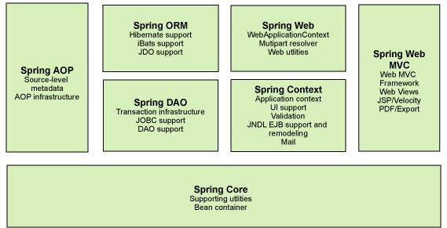

# Spring

## 一、MyBatis

## 二、Spring

- Spring是一个免费的开源框架
- Spring是一个轻量级的、非入侵式的框架
- 控制翻转（IOC），面向切面编程
- 支持事务的处理，对框架整合的支持

*Spring是一个轻量级的控制翻转和面向切面编程的框架。*



### maven依赖

```xml
<!-- https://mvnrepository.com/artifact/org.springframework/spring-webmvc -->
<dependency>
    <groupId>org.springframework</groupId>
    <artifactId>spring-webmvc</artifactId>
    <version>5.2.5.RELEASE</version>
</dependency>

<!-- https://mvnrepository.com/artifact/org.springframework/spring-jdbc -->
<dependency>
    <groupId>org.springframework</groupId>
    <artifactId>spring-jdbc</artifactId>
    <version>5.2.5.RELEASE</version>
</dependency>
```


## 三、Spring MVC

## 四、Spring Boot

